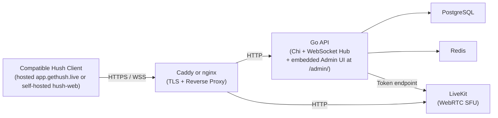

# Architecture

This document describes the Go server's internal architecture, database schema, WebSocket hub, MLS key storage, admin control plane, service identity, transparency log, and instance configuration.

---

## 1. System Overview



The Go backend is a stateless relay. It authenticates requests, routes ciphertext between clients, stores blobs it cannot read, and manages guild membership. All encryption happens in the client (see `hush-web` and `hush-crypto`).

---

## 2. Project Structure

```
server/
├── cmd/hush/main.go         # Entry point, Chi router, middleware, graceful shutdown
└── internal/
    ├── api/                 # HTTP handlers
    │   ├── auth.go          # Registration, challenge-response, JWT issuance
    │   ├── guilds.go        # Guild CRUD, join/leave, member management
    │   ├── channels.go      # Channel CRUD, move, permissions
    │   ├── messages.go      # Message history (ciphertext fetch)
    │   ├── mls.go           # KeyPackage upload/fetch, commit delivery
    │   ├── transparency.go  # Append and verify transparency log entries
    │   ├── livekit.go       # LiveKit access token generation
    │   ├── admin.go         # Shared admin wiring and helpers
    │   ├── admin_auth.go    # Bootstrap, login, logout, session restore
    │   └── admin_management.go # Owner/admin management and admin-only resources
    ├── auth/
    │   ├── jwt.go           # JWT sign and verify (HS256, configurable secret)
    │   └── challenge.go     # Ed25519 nonce challenge-response
    ├── config/
    │   └── config.go        # Environment variable loading and validation
    ├── db/
    │   ├── store.go         # Store interface (enables dependency injection)
    │   ├── users.go         # User queries
    │   ├── guilds.go        # Guild and membership queries
    │   ├── channels.go      # Channel queries
    │   ├── messages.go      # Message queries
    │   ├── keys.go          # MLS KeyPackage queries
    │   └── transparency.go  # Transparency log queries
    ├── livekit/
    │   └── token.go         # LiveKit access token builder
    ├── models/
    │   └── models.go        # Shared data types (User, Guild, Channel, Message, etc.)
    └── ws/
        ├── hub.go           # WebSocket hub: connection registry, BroadcastToServer
        ├── client.go        # Per-connection goroutines: read pump, write pump
        └── handler.go       # Message type dispatch

migrations/                  # Sequential SQL migration files (golang-migrate)
scripts/
├── setup.sh                 # First-run self-hoster setup
└── update.sh                # Upgrade (backup, pull, rebuild, restart)
caddy/
├── Caddyfile                # Development reverse proxy
└── Caddyfile.self-hoster.tmpl  # Self-host production template
nginx/
└── hush.conf                # nginx config template for existing nginx setups
livekit/
└── livekit.yaml             # LiveKit server configuration
```

---

## 3. Database Schema (High-Level)

All tables are created by migrations in `migrations/`. Schema is managed by `golang-migrate`. Never modify the database schema by hand - create a new migration file.

### Core tables

| Table | Key columns | Notes |
|-|-|-|
| `users` | `id` UUID, `public_key` BYTEA, `username` TEXT | One row per registered identity. No password, no email. |
| `servers` | `id` UUID, `encrypted_metadata` BYTEA, `access_policy`, `discoverable` | Guild records. Name is in `encrypted_metadata`; opaque to server. |
| `server_members` | `server_id` UUID, `user_id` UUID, `permission_level` INT | Permission 0=member, 1=mod, 2=admin, 3=owner. |
| `channels` | `id` UUID, `server_id` UUID, `type` (text/voice/category), `encrypted_metadata` BYTEA, `position` INT | Channel name in `encrypted_metadata`. |
| `messages` | `id` UUID, `channel_id` UUID, `sender_id` UUID, `ciphertext` BYTEA, `created_at` TIMESTAMPTZ | All messages stored as MLS ciphertext. |
| `mls_key_packages` | `id` UUID, `user_id` UUID, `key_package_data` BYTEA, `created_at` | One-time-use KeyPackages. Consumed on group add. |
| `device_certificates` | `user_id` UUID, `device_public_key` BYTEA, `certificate` BYTEA | Multi-device trust. Certificate = Sign(existing_priv, new_pub). |
| `transparency_log` | `id` BIGINT, `entry_type`, `user_id`, `payload` BYTEA, `leaf_hash` BYTEA, `created_at` | Key operation log. Never modified after insert. |
| `instance_config` | `key` TEXT, `value` TEXT | Single-row config: registration_mode, server_creation_policy. |
| `instance_admins` | `id` UUID, `username` TEXT, `email` TEXT, `password_hash` TEXT, `role` TEXT, `is_active` BOOL | Local admin control-plane accounts (`owner` or `admin`). |
| `instance_admin_sessions` | `id` UUID, `admin_id` UUID, `expires_at` TIMESTAMPTZ, `last_seen_at` TIMESTAMPTZ | Secure server-issued admin sessions. |
| `instance_service_identity` | `id` UUID, `public_key` BYTEA, `wrapped_private_key` BYTEA | Non-discoverable technical Hush identity for instance-owned crypto flows. |
| `auth_challenges` | `nonce` TEXT, `expires_at` TIMESTAMPTZ | Short-lived nonces for challenge-response. Cleaned up after use. |

### Indexes

Indexed columns for common access patterns: `server_members(server_id)`, `server_members(user_id)`, `channels(server_id)`, `messages(channel_id, created_at)`, `mls_key_packages(user_id)`, `transparency_log(user_id)`.

---

## 4. WebSocket Hub

`internal/ws/hub.go` maintains a registry of active WebSocket connections grouped by guild (server) membership.

```
Hub
├── connections: map[serverID]map[connID]*Client
├── Register(client)     - add connection; subscribe to each guild the user belongs to
├── Unregister(client)   - remove connection; clean up all subscriptions
└── BroadcastToServer(serverID, message)  - fan out to all connections in that guild
```

Each `Client` has two goroutines:
- **Read pump:** reads WebSocket frames, dispatches to handler
- **Write pump:** drains outbound channel to WebSocket

Message types handled:
- `message.send` - validate sender membership, write to DB, broadcast to guild
- `mls.commit` - validate, persist, broadcast MLS commit to group members
- `mls.welcome` - deliver Welcome message to specific user
- `presence.*` - broadcast presence events (join/leave voice channel)

---

## 5. MLS KeyPackage Storage

KeyPackages are one-time-use public key material that allow other clients to add a user to an MLS group without the user being online.

- Upload: `POST /api/mls/key-packages` - user uploads a batch of KeyPackages
- Fetch: `GET /api/mls/key-packages/:user_id` - returns one KeyPackage and marks it consumed
- The server stores KeyPackage bytes opaquely (BYTEA). It cannot read the key material inside.
- Clients are expected to maintain a minimum number of KeyPackages; `hush-web` includes a background maintenance hook.

---

## 6. Key Transparency Log

Hush implements a signed Merkle tree of key operations per instance (T.1).

- All key operations (registration, device add, device revoke, KeyPackage rotation) are appended to `transparency_log`.
- Each leaf is signed with an Ed25519 key seeded from `TRANSPARENCY_LOG_PRIVATE_KEY`.
- Clients verify inclusion proofs at login and on key changes via `GET /api/transparency/verify`.
- The log is append-only. No row is ever updated or deleted.

**Implementation:** `internal/api/transparency.go` and `internal/db/transparency.go`.

---

## 7. Authentication

### Challenge-response (Ed25519)

1. Client calls `POST /api/auth/challenge` - server generates a random nonce (stored with a short TTL in `auth_challenges`).
2. Client signs the nonce with its Ed25519 private key.
3. Client calls `POST /api/auth/authenticate` with the nonce and signature.
4. Server fetches the nonce, verifies expiry, verifies the Ed25519 signature against the user's stored public key, deletes the nonce, and issues a JWT.

No passwords. Authentication is cryptographic ownership proof.

### JWT session

JWTs are HS256-signed with `JWT_SECRET`. Standard claims: `sub` (user UUID), `exp` (configurable TTL). All protected routes validate the JWT via middleware in `cmd/hush/main.go`.

### Admin access

Admin endpoints use a separate local control plane:

1. `POST /api/admin/bootstrap/status` reports whether the instance still has no local admins.
2. `POST /api/admin/bootstrap/claim` consumes `ADMIN_BOOTSTRAP_SECRET` to create the first `owner`.
3. `POST /api/admin/session/login` verifies the local admin password hash and returns an `HttpOnly` session cookie.
4. `GET /api/admin/session/me` restores the dashboard session after refresh.
5. `POST /api/admin/session/logout` invalidates the server-side session record.

Human admins are not Hush users by default. They are local control-plane accounts. Instance service identity material is stored separately and is not usable for dashboard login.

---

## 8. Instance Configuration

`instance_config` table stores key-value pairs for per-instance behavior:

| Key | Values | Default | Description |
|-|-|-|-|
| `registration_mode` | `open`, `invite-only` | `open` | Controls who can register |
| `server_creation_policy` | `all`, `admin-only` | `all` | Controls who can create guilds |

Configured via the admin dashboard (`GET/PUT /api/admin/config`). Changes take effect immediately without restart.

---

## 9. Instance Service Identity

The instance provisions one non-discoverable service identity. Its purpose is to support future instance-owned cryptographic flows without giving human operators direct access to user private material.

- Provisioned once during admin control-plane bootstrap
- Public identity is stored in Postgres
- Private material is wrapped at rest with `SERVICE_IDENTITY_MASTER_KEY`
- Not usable as a dashboard login identity
- Not exposed in normal guild/member UI

This keeps human admin auth and cryptographic service ownership separate.

---

## 10. Infrastructure (Docker Compose)

The self-host backend/media stack is defined in `docker-compose.prod.yml`. The default self-host proxy layer lives in `docker-compose.caddy.yml`. `hush-web` is a separate repository and is not bundled into the server self-host setup.

| Service | Image | Purpose |
|-|-|-|
| `hush-api` | Local build from this repo | Go backend |
| `postgres` | `postgres:16-alpine` | Primary database |
| `redis` | `redis:7-alpine` | Session cache, rate limiting |
| `livekit` | `livekit/livekit-server:v1.10.1` | WebRTC SFU |
| `caddy` | `caddy:2-alpine` | Optional default TLS termination / reverse proxy |

All services communicate on an internal Docker network. PostgreSQL and Redis are not exposed to the public internet. Browser clients connect through either the default Caddy layer or an operator-managed nginx reverse proxy.
